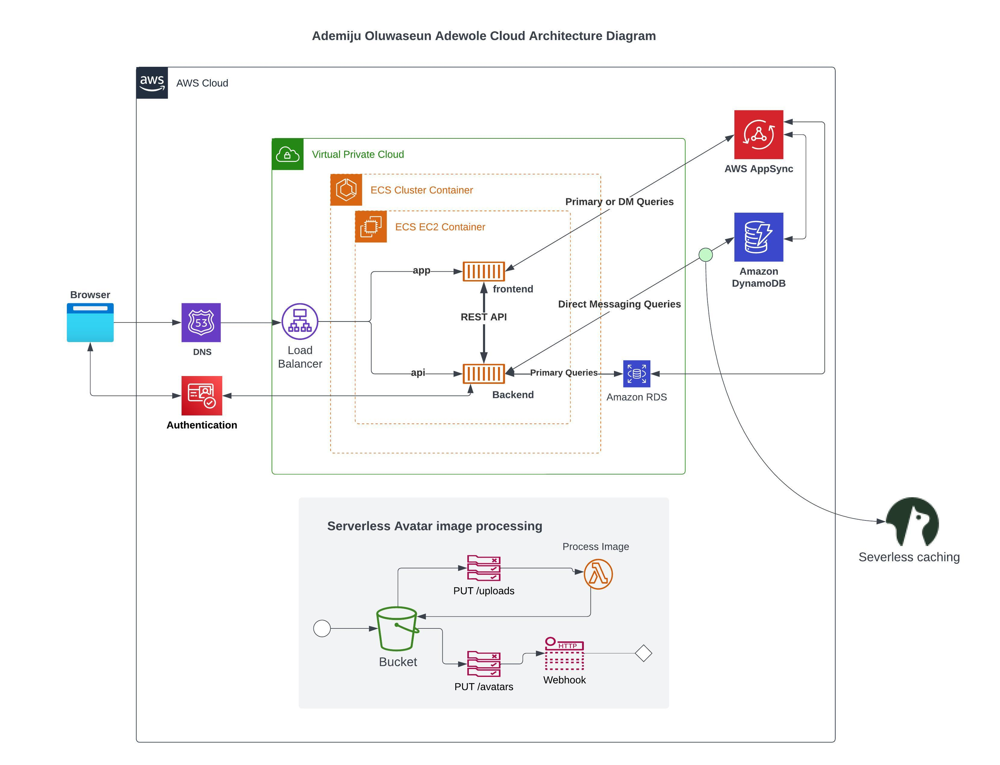

# Week 0 — Billing and Architecture

## Required Homework

### Recreate Logical Architectural Diagram in Lucid Charts
I had it easy recreating a logical Architectural Diagram in Lucid Charts and that's thanks to the well detailed video by our instructor. Attached below is an image proof of my work and the link to access the work on Lucid:

A link to my work on [Lucid chart](https://lucid.app/lucidchart/2e1e5dd0-23df-4bcc-951d-0faa20345b6f/edit?viewport_loc=-1071%2C507%2C2573%2C1312%2C0_0&invitationId=inv_2043f5a5-0f49-430b-a100-6e5dfde3a011)

### Install and verify AWS CLI

## Homework Challenge

### Review all the questions of each pillars in the Well Architected Tool (No specialized lens)
After reviewing questions of each pillars in the Well Architected Tool, i was able to come up with the summary below: 
The Well-Architected Tool provided by AWS contains a series of inquiries aligned with the five pillars of the framework. The questions for each pillar are as follows:

1. Operational Excellence: How do you manage and operate your systems? What steps do you take to ensure your workloads are efficient and effective? How do you support your operations to provide value to the business?

2. Security: What measures do you take to protect your data and assets? How do you manage security and compliance at scale? What is your plan for security events?

3. Reliability: How do you ensure that your workloads are resilient and scalable? How do you manage change and design your workloads to handle it? How do you maintain performance and availability?

4. Performance Efficiency: How do you choose the appropriate resources to run your workloads? What steps do you take to optimize cost and efficiency? How do you measure and optimize your workload's performance over time?

5. Cost Optimization: How do you use AWS pricing models to optimize cost? How do you analyze and manage costs? How do you continuously improve and eliminate wasteful spending?

Each question has additional queries and considerations to help organizations evaluate their architecture and identify areas for improvement. By addressing these questions and implementing best practices for each pillar, organizations can create and manage dependable, efficient, and secure workloads in the cloud.

### Research the technical and service limits of specific services and how they could impact the technical path for technical flexibility.
Based on my research, i realized that When designing and implementing a solution in the cloud, it's important to be aware of the technical and service limits of the specific services being used, as they can impact the technical path for technical flexibility. Here are some examples of technical and service limits of specific services:

1. Amazon EC2: Amazon EC2 has several service limits, including the number of instances, EBS volumes, and IP addresses that can be used per account. These limits can impact the ability to scale an application, and can also affect the availability and performance of the application. To mitigate this, organizations can consider using auto-scaling groups to automatically adjust the number of instances based on demand, and implementing load balancing to distribute traffic across instances.

2. Amazon S3: Amazon S3 has service limits on the number of buckets, objects, and data transfer that can be used per account. These limits can impact the ability to store and retrieve data, and can also affect the cost of using the service. To mitigate this, organizations can consider using lifecycle policies to automatically transition data to less expensive storage classes, and leveraging cloud-native data management solutions like Amazon Glacier for long-term archiving.

3. AWS Lambda: AWS Lambda has service limits on the number of concurrent executions, maximum memory size, and maximum execution time that can be used per account. These limits can impact the ability to run serverless functions at scale, and can also affect the performance and cost of using the service. To mitigate this, organizations can consider implementing event-driven architectures to distribute workloads across multiple functions, and using AWS Step Functions to orchestrate complex workflows.

4. Amazon RDS: Amazon RDS has service limits on the number of instances, storage capacity, and IOPS that can be used per account. These limits can impact the ability to scale a database, and can also affect the availability and performance of the application. To mitigate this, organizations can consider using read replicas to distribute read traffic across multiple instances, and leveraging multi-availability zone deployments to provide high availability and disaster recovery capabilities.

In general, it is important to understand the service limits of specific services and how they can impact the technical path for technical flexibility. By designing for scale, resilience, and cost optimization, organizations can ensure that they are able to take advantage of the flexibility and benefits of cloud computing, while also mitigating the risks associated with service limits

